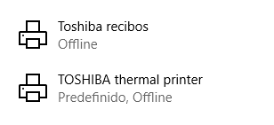
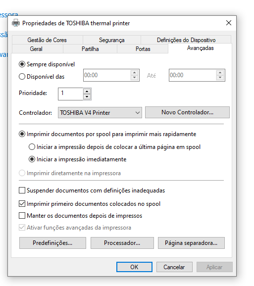
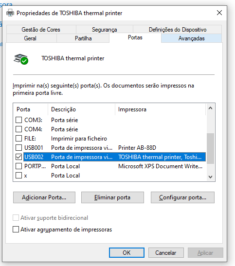
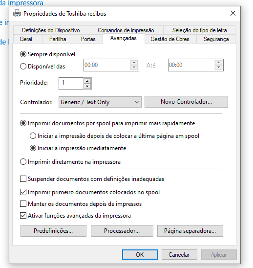
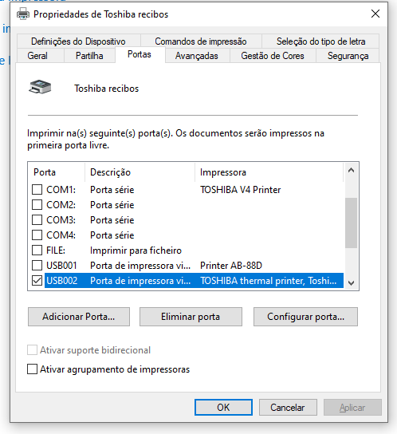

# Toshiba TRST-A10 setup on Windows 10

I need to install two printers for making this printer work:

The first one is the real printer, using the toshiba drivers:

Although it was able to connect and to run "print test page", the integration with the Java app was not working - it was not printing what I as sending, it was failing silently (no errors).

Then, I had to install a second printer using the same port, but using the "Generic / Text only" driver:

Then, on the code, you show call for the printer name that you have configured on the Windows Printers config.